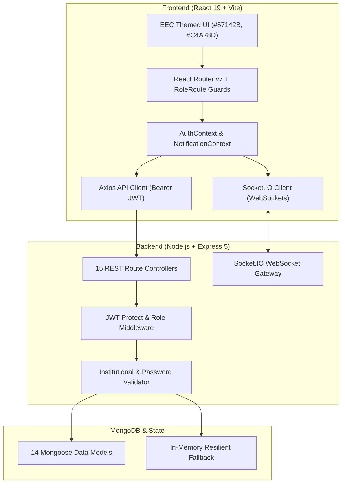

# Alumni Student Connect — Comprehensive System Walkthrough

## Executive Summary

**Alumni Student Connect** is an institutional web platform tailored for **Easwari Engineering College (EEC)**. It connects Students, Alumni, Faculty, and Administrators through mentorship programs, campus and corporate job referrals, event management, real-time messaging, and institutional verification.

---

## 🏗️ Architecture & Tech Stack



---

## 🛡️ ALUMNI FACULTY VERIFICATION WORKFLOW (NEW)

### 1. Business Logic & Authorization Policy
Registration alone does **not** grant alumni permissions to mentor students or post campus opportunities. Newly registered alumni must be reviewed and approved by department faculty coordinators.

```
Alumni Registration
        ↓
verificationStatus = "pending" (isVerified = false)
        ↓
Notification Sent: "Verification Pending"
        ↓
Faculty Reviews Alumni at /faculty/alumni-approvals
        ↓
    ┌───────────────┴───────────────┐
    ▼                               ▼
[APPROVE]                       [REJECT]
verificationStatus="approved"   verificationStatus="rejected"
isVerified=true                 isVerified=false
Notification: Approved          Notification: Rejected
Can mentor & post opportunities Restricted from professional actions
```

---

### 2. Database Schema Changes
- **[User.js](file:///c:/Users/hasee/OneDrive/Desktop/Alumini%20Student%20Connect/server/models/User.js)**:
  - Added `verificationStatus`: enum `["pending", "approved", "rejected"]`, default `"pending"`.
  - Maintained synchronized `isVerified`: `Boolean`, default `false` for newly registered alumni.
- **[AlumniProfile.js](file:///c:/Users/hasee/OneDrive/Desktop/Alumini%20Student%20Connect/server/models/AlumniProfile.js)**:
  - Added `verificationStatus`: enum `["pending", "approved", "rejected"]`, default `"pending"`.

---

### 3. Backend APIs Added / Modified
| Endpoint | Method | Role Allowed | Description |
| :--- | :---: | :---: | :--- |
| `/api/faculty/alumni/pending` | `GET` | Faculty, Admin | Retrieves list of pending alumni from MongoDB with department, graduation batch, company, and role details. |
| `/api/faculty/alumni/:id/approve` | `PUT` | Faculty, Admin | Approves alumni, sets `verificationStatus = "approved"`, `isVerified = true`, and creates approval notification. |
| `/api/faculty/alumni/:id/reject` | `PUT` | Faculty, Admin | Rejects alumni verification, sets `verificationStatus = "rejected"`, `isVerified = false`, and creates rejection notification. |
| `/api/faculty/stats` | `GET` | Faculty, Admin | Returns real-time metrics including `pendingAlumniCount` for faculty dashboard. |
| `/api/jobs` | `POST` | Verified Alumni, Faculty, Admin | Enforces `verificationStatus === "approved"`. Unapproved alumni receive HTTP 403. |
| `/api/internships` | `POST` | Verified Alumni, Faculty, Admin | Enforces `verificationStatus === "approved"`. Unapproved alumni receive HTTP 403. |
| `/api/mentorship/request` | `POST` | Student | Enforces that target mentor has `verificationStatus === "approved"` and `isVerified === true`. Unapproved alumni target returns HTTP 403. |
| `/api/alumni` | `GET` | Public / Student | Filters out unapproved/pending/rejected alumni from mentor searches and directory. |
| `/api/admin/verify/:id` | `PUT` | Admin | Synchronized with new schema (`isVerified` and `verificationStatus`). |

---

### 4. Frontend UI & UX Enhancements

#### 👩‍🏫 Faculty Portal:
1. **New Page `/faculty/alumni-approvals` ([AlumniApprovals.jsx](file:///c:/Users/hasee/OneDrive/Desktop/Alumini%20Student%20Connect/client/src/pages/faculty/AlumniApprovals.jsx))**:
   - Lists real pending alumni from MongoDB.
   - Shows candidate name, email, department, graduation year, current employer, job title, industry, and skills.
   - Includes **"✓ Approve"** and **"✕ Reject"** buttons with confirmation dialogs.
   - Includes **"👁️ View Details"** modal for inspection.
2. **Navigation & Dashboard Stats ([FacultyLayout.jsx](file:///c:/Users/hasee/OneDrive/Desktop/Alumini%20Student%20Connect/client/src/layouts/FacultyLayout.jsx) & [FacultyDashboard.jsx](file:///c:/Users/hasee/OneDrive/Desktop/Alumini%20Student%20Connect/client/src/pages/faculty/FacultyDashboard.jsx))**:
   - Added `"Alumni Approvals"` nav tab.
   - Added clickable **"Pending Alumni Approvals"** stat card with live pending counter that routes to `/faculty/alumni-approvals`.

#### 💼 Alumni Portal:
1. **Status Banners & Indicators ([AlumniDashboard.jsx](file:///c:/Users/hasee/OneDrive/Desktop/Alumini%20Student%20Connect/client/src/pages/alumni/AlumniDashboard.jsx) & [AlumniLayout.jsx](file:///c:/Users/hasee/OneDrive/Desktop/Alumini%20Student%20Connect/client/src/layouts/AlumniLayout.jsx))**:
   - **Pending Verification**: Professional amber alert banner explaining verification is pending faculty review.
   - **Verification Rejected**: Red alert banner advising contact with the college alumni cell.
   - **Approved**: Verified badge shown; no warning banner.
2. **Action Controls ([PostJob.jsx](file:///c:/Users/hasee/OneDrive/Desktop/Alumini%20Student%20Connect/client/src/pages/alumni/PostJob.jsx) & [PostInternship.jsx](file:///c:/Users/hasee/OneDrive/Desktop/Alumini%20Student%20Connect/client/src/pages/alumni/PostInternship.jsx))**:
   - Form inputs and submit buttons check approval status and show verification notice if unapproved.

---

## 🧪 Verification & Security Test Suite

### 1. Faculty Alumni Verification Suite (20/20 Passed — 100%)
Test file: [server/tests/alumni_faculty_verification_test.js](file:///c:/Users/hasee/OneDrive/Desktop/Alumini%20Student%20Connect/server/tests/alumni_faculty_verification_test.js)

```
==================================================
ALUMNI FACULTY VERIFICATION SUITE — 20 TEST CASES
==================================================

✅ PASS: 1. Faculty logs in successfully
✅ PASS: 2. Student registers and logs in successfully
✅ PASS: 3. New Alumni registers with verificationStatus='pending' and isVerified=false
✅ PASS: 4. Alumni logs in and receives verificationStatus='pending'
✅ PASS: 5. Pending Alumni cannot post job (HTTP 403 rejection)
✅ PASS: 6. Pending Alumni cannot post internship (HTTP 403 rejection)
✅ PASS: 7. Student cannot request mentorship from unapproved alumni (HTTP 403)
✅ PASS: 8. Pending alumni is excluded from active mentors search
✅ PASS: 9. Student receives HTTP 403 when attempting faculty approval endpoint
✅ PASS: 10. Alumni receives HTTP 403 when attempting faculty approval endpoint
✅ PASS: 11. Faculty retrieves pending alumni list containing newly registered alumnus
✅ PASS: 12. Faculty approves alumni successfully (verificationStatus='approved')
✅ PASS: 13. Faculty stats endpoint returns accurate metrics
✅ PASS: 14. Approved Alumni login returns verificationStatus='approved' and isVerified=true
✅ PASS: 15. Approved alumni successfully posts a job opening (HTTP 201)
✅ PASS: 16. Approved alumni successfully posts an internship (HTTP 201)
✅ PASS: 17. Student can successfully request mentorship from approved alumni (HTTP 201)
✅ PASS: 18. Faculty rejects second alumni (verificationStatus='rejected')
✅ PASS: 19. Rejected alumni remains restricted from posting jobs (HTTP 403)
✅ PASS: 20. Existing Admin verification endpoint remains functional and synced with workflow

==================================================
TEST SUMMARY: 20 PASSED, 0 FAILED (100%)
==================================================
```

---

## 🔑 PASSWORD RECOVERY & EMAIL DELIVERY WORKFLOW (NEW)

### 1. Architectural Flow
```
User enters registered email on /forgot-password
        ↓
Backend validates email & generates 64-char crypto raw token
        ↓
SHA-256 hash of token + 30-min expiration stored in MongoDB User model
        ↓
Styled HTML Email dispatched with Easwari Engineering College branding & Reset URL
        ↓
User clicks link -> opens /reset-password/:token
        ↓
User enters new password with live security requirements checklist
        ↓
Backend matches SHA-256 hashed token, verifies non-expired, validates password strength
        ↓
Password hashed with bcrypt, reset token invalidated (nullified)
        ↓
User successfully logs in with new password
```

### 2. Endpoints Added
| Endpoint | Method | Access | Purpose |
| :--- | :---: | :---: | :--- |
| `/api/auth/forgot-password` | `POST` | Public | Generates secure token, hashes and saves to User, sends HTML email, returns generic response (anti-enumeration). |
| `/api/auth/reset-password/:token` | `POST` | Public | Verifies token & expiry, validates password policy, hashes with bcrypt, updates DB and clears token. |

### 3. Email Delivery Configuration (`server/.env`)
```bash
# SMTP Configuration (Gmail SMTP with App Password)
SMTP_HOST=smtp.gmail.com
SMTP_PORT=587
SMTP_SECURE=false
SMTP_USER=your_email@gmail.com
SMTP_PASS=your_16_char_app_password
EMAIL_FROM="Easwari Engineering College AlumniConnect" <noreply@eec.srmrmp.edu.in>
CLIENT_URL=http://localhost:5174
```

---

### 4. Complete Test Matrix

| Test Suite | File | Tests | Result |
| :--- | :--- | :---: | :---: |
| **Password Reset & Recovery** | [password_reset_test.js](file:///c:/Users/hasee/OneDrive/Desktop/Alumini%20Student%20Connect/server/tests/password_reset_test.js) | 12 | **12/12 Passed (100%)** |
| **Alumni Faculty Approval Suite** | [alumni_approval_test.js](file:///c:/Users/hasee/OneDrive/Desktop/Alumini%20Student%20Connect/server/tests/alumni_approval_test.js) | 16 | **16/16 Passed (100%)** |
| **Faculty Alumni Verification** | [alumni_faculty_verification_test.js](file:///c:/Users/hasee/OneDrive/Desktop/Alumini%20Student%20Connect/server/tests/alumni_faculty_verification_test.js) | 20 | **20/20 Passed (100%)** |
| **Institutional Email Domain** | [domain_validation_test.js](file:///c:/Users/hasee/OneDrive/Desktop/Alumini%20Student%20Connect/server/tests/domain_validation_test.js) | 20 | **20/20 Passed (100%)** |
| **Phase 1 Auth & Access** | [phase1_auth_test.js](file:///c:/Users/hasee/OneDrive/Desktop/Alumini%20Student%20Connect/server/tests/phase1_auth_test.js) | 10 | **10/10 Passed (100%)** |
| **Full E2E Integration Suite** | [full_e2e_test.js](file:///c:/Users/hasee/OneDrive/Desktop/Alumini%20Student%20Connect/server/tests/full_e2e_test.js) | 29 | **29/29 Passed (100%)** |
| **Frontend Production Build** | `npm run build` | 174 modules | **0 errors (built in 386ms)** |

---

## 🎨 Easwari Engineering College Theme Colors Preserved
- Primary Burgundy: `#57142B`
- Warm Gold Accent: `#C4A78D`
- Neutral Brown: `#6C574C`
- Deep Charcoal: `#391F25`
- Light Sand Border: `#DAD0BB`
- Pure Background: `#FFFFFF` / `#F7F5F0`

